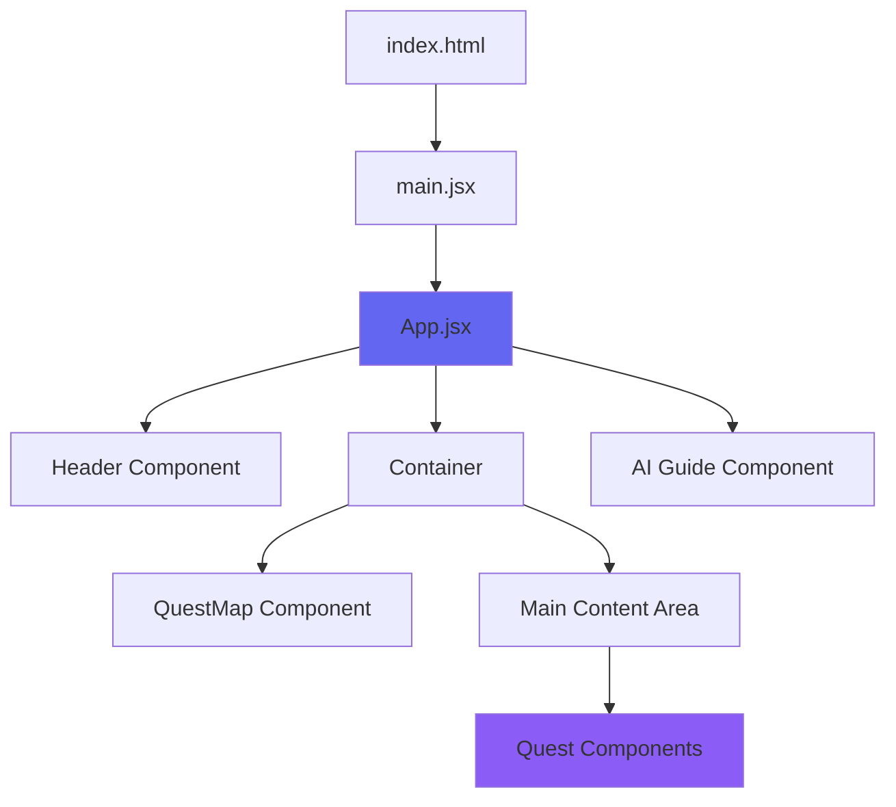
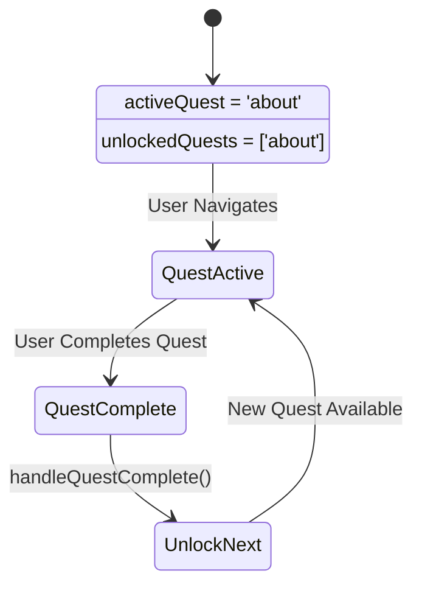
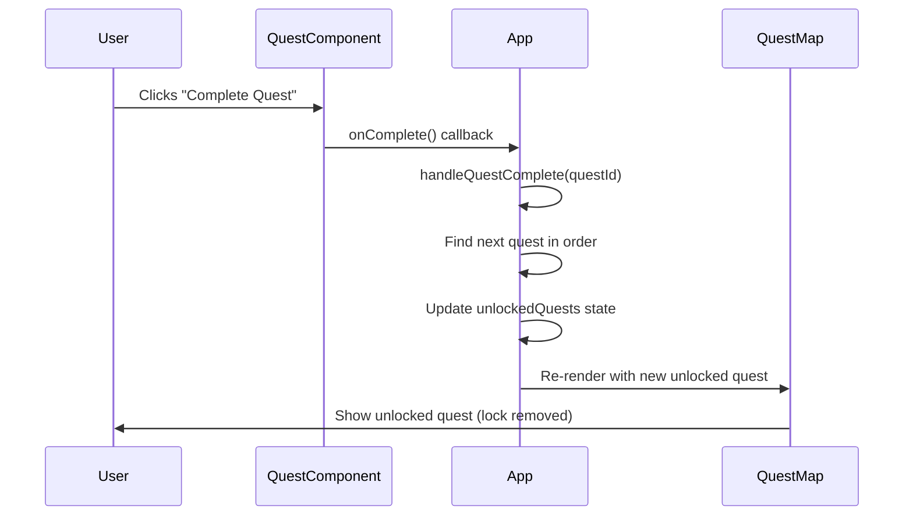
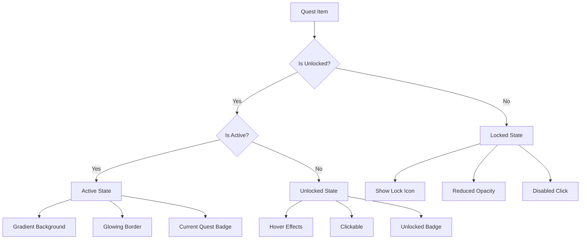
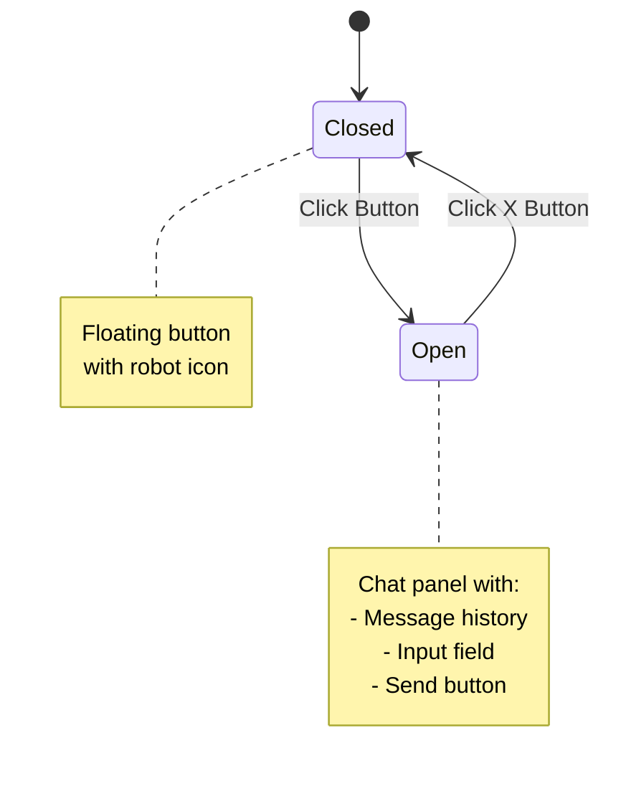

# 🎮 Gaming RPG Portfolio - Complete Documentation

## 📋 Table of Contents
1. [Overview](#overview)
2. [Architecture](#architecture)
3. [Component Structure](#component-structure)
4. [Quest System Flow](#quest-system-flow)
5. [State Management](#state-management)
6. [Styling Approach](#styling-approach)
7. [Component Details](#component-details)
8. [Data Flow](#data-flow)

---

## 🎯 Overview

This is a unique gaming-themed portfolio website that uses an RPG (Role-Playing Game) interface metaphor. Users navigate through different "quests" (portfolio sections) that unlock progressively, creating an engaging and interactive experience.

### Key Concepts
- **Quest** = Portfolio Section (About, Experience, Skills, etc.)
- **Quest Map** = Navigation Menu
- **Quest Unlocking** = Progressive Navigation System
- **Quest Completion** = Unlocking the next section
- **AI Guide** = Interactive chatbot assistant

---

## 🏗️ Architecture

### High-Level Architecture



### Technology Stack

```
┌─────────────────────────────────────┐
│         Application Layer           │
│  React 18 + JSX Components          │
├─────────────────────────────────────┤
│         Build Tool Layer            │
│  Vite (Fast Dev Server & Build)     │
├─────────────────────────────────────┤
│         Styling Layer               │
│  CSS3 + Custom Animations           │
├─────────────────────────────────────┤
│         Icon Library                │
│  React Icons (FA Icons)             │
└─────────────────────────────────────┘
```

---

## 🧩 Component Structure

### Component Hierarchy

```
App (Root Component)
├── Header
│   ├── Profile Section
│   │   ├── Profile Image
│   │   └── Name & Title
│   └── Quest Title with Stars
│
├── Container
│   ├── QuestMap (Sidebar Navigation)
│   │   └── 7 Quest Items (See detailed breakdown below)
│   │
│   └── Main Content
│       └── Active Quest Component
│
└── AIGuide (Floating)
    ├── Toggle Button
    └── Chat Panel
```

### Side Menu (Quest Map) Items - Detailed Breakdown

#### 1. 👤 About Me Quest
**Status**: Unlocked by default (Starting Quest)  
**Purpose**: Introduce yourself and tell your story  
**Icon**: `FaUser` (User icon)  
**What it contains**:
- Profile card with photo and location
- Role and professional badges
- Interactive story progression (3 steps)
- Personal introduction and journey narrative
- "The Beginning", "The Journey", "The Mission" story arc

**Key Features**:
- Story dots showing progress (1/3, 2/3, 3/3)
- Next/Complete Quest button
- Profile badges (AI Enthusiast, Innovation Focused)
- Animated emoji icons (🌟, 💻, 🚀)

---

#### 2. 💼 Experience Quest
**Status**: Locked (Unlocks after completing About Me)  
**Purpose**: Showcase professional work history  
**Icon**: `FaBriefcase` (Briefcase icon)  
**What it contains**:
- Professional timeline of work experience
- Job titles, companies, and date ranges
- Detailed job descriptions
- Technology tags for each role
- Visual timeline with gradient line

**Key Features**:
- Vertical timeline layout
- Hover effects on timeline items
- Tech stack badges (React, Node.js, AWS, etc.)
- Icon badges for each position

---

#### 3. 🎓 Education Quest
**Status**: Locked (Unlocks after completing Experience)  
**Purpose**: Display academic background and learning  
**Icon**: `FaGraduationCap` (Graduation cap icon)  
**What it contains**:
- Degree information (University, Field, Grade)
- Professional certifications list
- Continuous learning courses
- Educational achievements

**Key Features**:
- Grid layout with 3 cards
- Animated education icons (🎓, 📜, 📚)
- Honor grade badge
- Certification list with hover effects

---

#### 4. 💻 Skills Quest
**Status**: Locked (Unlocks after completing Education)  
**Purpose**: Visualize technical skills and proficiency  
**Icon**: `FaCode` (Code icon)  
**What it contains**:
- Frontend Development skills (React, JavaScript, HTML/CSS)
- Backend Development skills (Node.js, Python, Databases)
- DevOps & Cloud skills (AWS, Docker, CI/CD)
- Tools & Technologies grid (Git, MongoDB, PostgreSQL, etc.)

**Key Features**:
- Animated progress bars (0% → actual %)
- Percentage values displayed
- Gradient-filled skill bars
- Interactive tech badges grid
- Skills grouped by category

---

#### 5. 🏆 Activities Quest
**Status**: Locked (Unlocks after completing Skills)  
**Purpose**: Highlight achievements and community involvement  
**Icon**: `FaTrophy` (Trophy icon)  
**What it contains**:
- Hackathon wins and competition achievements
- Open source contributions
- Speaking engagements and tech talks
- Mentorship and teaching activities
- Community involvement and volunteer work

**Key Features**:
- Card grid layout
- Rotating icons on hover (360° spin)
- Shimmer effect animation
- Date badges for each activity
- Icon badges (Trophy, Medal, Star, Award)

---

#### 6. 📁 Projects Quest
**Status**: Locked (Unlocks after completing Activities)  
**Purpose**: Showcase portfolio of completed projects  
**Icon**: `FaFolder` (Folder icon)  
**What it contains**:
- Project cards with images
- Project titles and descriptions
- Technology stack used
- GitHub repository links
- Live demo links
- Project screenshots/thumbnails

**Key Features**:
- Image zoom on hover
- Overlay with action buttons (GitHub, Demo)
- Tech stack tags
- Responsive grid layout
- Card lift animation on hover
- Projects using Unsplash images (customizable)

---

#### 7. ✉️ Contact Quest
**Status**: Locked (Unlocks after completing Projects - Final Quest)  
**Purpose**: Provide contact information and communication form  
**Icon**: `FaEnvelope` (Envelope icon)  
**What it contains**:
- Contact form (Name, Email, Message)
- Social media links (Email, GitHub, LinkedIn, Twitter)
- Call-to-action message
- Submit button

**Key Features**:
- Two-column layout (Social links + Form)
- Form validation
- Interactive social links with icons
- Hover effects on links
- Gradient submit button
- Form input focus effects

---

### Quest Map Visual States

Each quest item in the sidebar can have three different states:

```
┌─────────────────────────────────────────────┐
│  ACTIVE QUEST (Currently Viewing)          │
│  • Gradient background (purple/blue)       │
│  • Glowing border                          │
│  • "Current Quest" status badge            │
│  • No lock icon                            │
│  • Clickable                               │
└─────────────────────────────────────────────┘

┌─────────────────────────────────────────────┐
│  UNLOCKED QUEST (Available to View)        │
│  • Semi-transparent background             │
│  • "Unlocked" status badge                 │
│  • No lock icon                            │
│  • Hover effects enabled                   │
│  • Clickable                               │
│  • Slides right on hover                   │
└─────────────────────────────────────────────┘

┌─────────────────────────────────────────────┐
│  LOCKED QUEST (Not Yet Available)          │
│  • Reduced opacity (50%)                   │
│  • "Locked" status badge                   │
│  • Lock icon (🔒) displayed                │
│  • No hover effects                        │
│  • Not clickable                           │
│  • Grayed out appearance                   │
└─────────────────────────────────────────────┘
```

---

## 🎮 Quest System Flow

### Quest Progression Flow

```mermaid
graph LR
    A[App Loads] --> B[About Me Quest Unlocked]
    B --> C{User Completes Quest?}
    C -->|Yes| D[Experience Quest Unlocked]
    D --> E{User Completes Quest?}
    E -->|Yes| F[Education Quest Unlocked]
    F --> G{User Completes Quest?}
    G -->|Yes| H[Skills Quest Unlocked]
    H --> I{User Completes Quest?}
    I -->|Yes| J[Activities Quest Unlocked]
    J --> K{User Completes Quest?}
    K -->|Yes| L[Projects Quest Unlocked]
    L --> M{User Completes Quest?}
    M -->|Yes| N[Contact Quest Unlocked]
    N --> O[All Quests Complete! 🎉]
    
    style A fill:#6366f1
    style O fill:#10b981
```



### Quest Order Definition

```javascript
const questOrder = [
  'about',      // Index 0 - Unlocked by default
  'experience', // Index 1
  'education',  // Index 2
  'skills',     // Index 3
  'activities', // Index 4
  'projects',   // Index 5
  'contact'     // Index 6
]
```

---

## 📊 State Management

### App Component State



### State Variables

```javascript
// App.jsx State
const [activeQuest, setActiveQuest] = useState('about')
const [unlockedQuests, setUnlockedQuests] = useState(['about'])

// State Flow:
// 1. User completes quest → onComplete() callback triggered
// 2. handleQuestComplete() finds next quest in order
// 3. Next quest added to unlockedQuests array
// 4. User can now click on newly unlocked quest
```

### State Update Flow



---

## 🎨 Styling Approach

### CSS Architecture

```
Styling Hierarchy
├── index.css (Global Styles)
│   ├── Reset & Base Styles
│   ├── Scrollbar Styling
│   └── Body & Root Styles
│
├── App.css (Layout Styles)
│   ├── Container Layout
│   ├── Section Styles
│   └── Responsive Breakpoints
│
└── Component-Specific CSS
    ├── Header.css
    ├── QuestMap.css
    ├── AIGuide.css
    └── quests/
        ├── AboutQuest.css
        ├── ExperienceQuest.css
        ├── EducationQuest.css
        ├── SkillsQuest.css
        ├── ActivitiesQuest.css
        ├── ProjectsQuest.css
        └── ContactQuest.css
```

### Design System

```
Color Palette:
┌────────────────────────────────────┐
│ Primary Gradient                   │
│ #6366f1 → #8b5cf6 (Indigo → Purple)│
├────────────────────────────────────┤
│ Background                          │
│ #0a0e27 → #1a1d35 (Dark Blue)     │
├────────────────────────────────────┤
│ Text Colors                         │
│ Primary: #ffffff                    │
│ Secondary: #cbd5e0                  │
│ Muted: #a0aec0                     │
├────────────────────────────────────┤
│ Accent Colors                       │
│ Gold (Stars): #fbbf24              │
│ Success: #4ade80                    │
│ Error: #ef4444                      │
└────────────────────────────────────┘
```

---

## 🔍 Component Details

### 1. App Component (`App.jsx`)

**Purpose**: Root component managing quest state and rendering logic

```javascript
// Key Responsibilities:
- Manage activeQuest state
- Manage unlockedQuests array
- Handle quest completion logic
- Render appropriate quest component
- Pass state to child components
```

**Props Flow**:
```
App
 ├─> Header (no props)
 ├─> QuestMap
 │    ├─ activeQuest
 │    ├─ unlockedQuests
 │    └─ onQuestSelect
 ├─> Quest Components
 │    └─ onComplete
 └─> AIGuide (no props)
```

---

### 2. Header Component (`Header.jsx`)

**Purpose**: Display profile info and portfolio title

```javascript
// Structure:
<header>
  ├─ <profile-section>
  │   ├─  Profile Picture
  │   └─ <profile-info>
  │       ├─ <h1> Name
  │       └─ <p> Title
  └─ <quest-title>
      ├─ Quest Icon
      ├─ Title Text
      └─ 5-Star Rating
</header>
```

**Features**:
- Sticky positioning (stays at top)
- Backdrop blur effect
- Animated quest icon (pulse effect)
- 5-star rating display

---

### 3. QuestMap Component (`QuestMap.jsx`)

**Purpose**: Sidebar navigation with quest progression

```javascript
// Quest Item States:
1. Active (currently viewing)
2. Unlocked (can navigate to)
3. Locked (cannot access yet)
```

**Quest Item Visual States**:


---

### 4. AboutQuest Component (`AboutQuest.jsx`)

**Purpose**: First quest introducing the developer

**Story Progression System**:
```javascript
// 3 Story Steps:
Step 1: "The Beginning" → Introduction
Step 2: "The Journey" → Development path
Step 3: "The Mission" → Current goals

// Navigation:
- Progress dots show current step
- Next button advances story
- Last step button completes quest
```

**Layout**:
```
┌─────────────────────────────────────┐
│      About Me Quest                 │
├──────────────┬──────────────────────┤
│              │                      │
│  Profile     │   Story              │
│  Card        │   Progression        │
│              │                      │
│  • Photo     │   • Current Step     │
│  • Location  │   • Progress Dots    │
│  • Role      │   • Next Button      │
│  • Badges    │                      │
│              │                      │
└──────────────┴──────────────────────┘
```

---

### 5. ExperienceQuest Component (`ExperienceQuest.jsx`)

**Purpose**: Display professional work history

**Timeline Structure**:
```
     ●  Senior Software Engineer
     │  Company Name | 2022 - Present
     │  Description...
     │  [React] [Node.js] [AWS]
     │
     ●  Software Engineer
     │  Another Company | 2020 - 2022
     │  Description...
     │  [JavaScript] [Python] [Docker]
     │
     ●  Junior Developer
        Digital Agency | 2019 - 2020
        Description...
        [React] [CSS3] [REST API]
```

**Features**:
- Vertical timeline with gradient line
- Icon badges for each position
- Tech tag pills
- Hover animations

---

### 6. EducationQuest Component (`EducationQuest.jsx`)

**Purpose**: Academic background and certifications

**Card Grid Layout**:
```
┌──────────┐  ┌──────────┐  ┌──────────┐
│   🎓     │  │   📜     │  │   📚     │
│ Bachelor │  │  Certs   │  │ Learning │
│  Degree  │  │          │  │          │
└──────────┘  └──────────┘  └──────────┘
```

---

### 7. SkillsQuest Component (`SkillsQuest.jsx`)

**Purpose**: Technical skills visualization

**Skill Categories**:
1. Frontend Development (React, JS/TS, HTML/CSS)
2. Backend Development (Node, Python, Databases)
3. DevOps & Cloud (AWS, Docker, CI/CD)
4. Tools & Technologies (Grid of badges)

**Progress Bar Animation**:
```javascript
// CSS animation on load
.skill-level {
  transition: width 1s ease;
  // Animates from 0% to actual percentage
}
```

---

### 8. ActivitiesQuest Component (`ActivitiesQuest.jsx`)

**Purpose**: Achievements and community involvement

**Card Features**:
- Icon with gradient background
- Rotating animation on hover
- Shimmer effect overlay
- Date badge

---

### 9. ProjectsQuest Component (`ProjectsQuest.jsx`)

**Purpose**: Portfolio showcase

**Project Card Structure**:
```
┌─────────────────────────┐
│    Project Image        │
│  [GitHub] [Demo] ← Overlay
├─────────────────────────┤
│ Project Title           │
│ Description...          │
│ [Tech] [Stack] [Tags]   │
└─────────────────────────┘
```

**Hover Effects**:
- Image zoom
- Overlay fade-in
- Icon buttons appear
- Card lift animation

---

### 10. ContactQuest Component (`ContactQuest.jsx`)

**Purpose**: Contact form and social links

**Layout**:
```
┌───────────┬─────────────────┐
│           │                 │
│  Social   │  Contact Form   │
│  Links    │                 │
│           │  • Name         │
│  • Email  │  • Email        │
│  • GitHub │  • Message      │
│  • LinkedIn│  [Submit]      │
│  • Twitter│                 │
│           │                 │
└───────────┴─────────────────┘
```

---

### 11. AIGuide Component (`AIGuide.jsx`)

**Purpose**: Interactive chatbot assistant

**Component States**:


**Features**:
- Fixed position (bottom-right)
- Slide-up animation
- Message threading
- Auto-scroll messages
- Typing simulation

---

## 🔄 Data Flow

### Complete User Journey Flow

```mermaid
flowchart TD
    Start[User Visits Site] --> Load[App Loads]
    Load --> Init[Initialize State]
    Init --> |activeQuest = 'about'| ShowAbout[Show About Quest]
    Init --> |unlockedQuests = ['about']| LockOthers[Lock Other Quests]
    
    ShowAbout --> UserView[User Reads Content]
    UserView --> NextStep{Story Step?}
    NextStep -->|Click Next| NextStory[Show Next Story]
    NextStory --> UserView
    NextStep -->|Last Step| Complete[Click Complete Quest]
    
    Complete --> Callback[onComplete Triggered]
    Callback --> Handler[handleQuestComplete]
    Handler --> FindNext[Find Next Quest in Order]
    FindNext --> Unlock[Add to unlockedQuests]
    Unlock --> Update[State Updates]
    Update --> Rerender[Components Re-render]
    Rerender --> QMUpdate[QuestMap Shows Unlocked]
    QMUpdate --> UserClick{User Clicks<br/>New Quest?}
    
    UserClick -->|Yes| ChangeQuest[setActiveQuest]
    ChangeQuest --> RenderNew[Render New Quest]
    RenderNew --> Loop[User Views New Quest]
    Loop --> Complete
    
    UserClick -->|No| Wait[User Explores]
    Wait --> UserClick
    
    style Start fill:#6366f1
    style Complete fill:#8b5cf6
    style Unlock fill:#10b981
```

### Props Drilling Pattern

```
App Component State
  ↓
  ├─→ QuestMap Component
  │    ├─ activeQuest (read)
  │    ├─ unlockedQuests (read)
  │    └─ onQuestSelect (callback)
  │         └─→ Updates activeQuest in App
  │
  └─→ Quest Components
       └─ onComplete (callback)
            └─→ Triggers handleQuestComplete in App
                 └─→ Updates unlockedQuests in App
```

---

## 🎯 Key Design Patterns

### 1. **Controlled Components Pattern**
All quest navigation is controlled by App state. Child components don't manage their own "active" or "unlocked" state.

### 2. **Callback Props Pattern**
Child components notify parent of events via callback functions:
- `onQuestSelect`: QuestMap → App
- `onComplete`: Quest Components → App

### 3. **Conditional Rendering Pattern**
```javascript
// App.jsx renders quest based on activeQuest state
const renderQuest = () => {
  switch(activeQuest) {
    case 'about': return <AboutQuest />
    case 'experience': return <ExperienceQuest />
    // ... etc
  }
}
```

### 4. **Progressive Disclosure Pattern**
Content is revealed progressively as users complete quests, maintaining engagement and creating a sense of achievement.

---

## 📱 Responsive Design

### Breakpoints

```css
/* Mobile First Approach */
Base: Mobile (320px+)
  ↓
Tablet: @media (min-width: 768px)
  ↓
Desktop: @media (min-width: 1024px)
```

### Layout Changes

```
Desktop (> 768px):
┌──────────────────────────────────┐
│         Header                   │
├──────┬───────────────────────────┤
│Quest │                           │
│ Map  │    Main Content           │
│      │                           │
└──────┴───────────────────────────┘

Mobile (< 768px):
┌──────────────────────────┐
│         Header           │
├──────────────────────────┤
│      Quest Map           │
├──────────────────────────┤
│                          │
│     Main Content         │
│                          │
└──────────────────────────┘
```

---

## 🚀 Performance Optimizations

### 1. **CSS Animations**
- Hardware-accelerated transforms
- Will-change properties for smooth animations
- Transition delays for staggered effects

### 2. **Lazy Component Rendering**
- Only active quest component is rendered
- Other quests aren't in the DOM

### 3. **Vite Build Optimization**
- Fast Hot Module Replacement (HMR)
- Optimized production builds
- Code splitting

---

## 🎨 Animation Reference

### Key Animations

```css
/* 1. Fade In (Quest sections) */
@keyframes fadeIn {
  from { opacity: 0; transform: translateY(20px); }
  to { opacity: 1; transform: translateY(0); }
}

/* 2. Pulse (Quest icon) */
@keyframes pulse {
  0%, 100% { transform: scale(1); }
  50% { transform: scale(1.1); }
}

/* 3. Float (Story icon) */
@keyframes float {
  0%, 100% { transform: translateY(0); }
  50% { transform: translateY(-10px); }
}

/* 4. Bounce (Education icons) */
@keyframes bounce {
  0%, 100% { transform: translateY(0); }
  50% { transform: translateY(-10px); }
}

/* 5. Slide Up (AI Guide panel) */
@keyframes slideUp {
  from { opacity: 0; transform: translateY(20px); }
  to { opacity: 1; transform: translateY(0); }
}
```

---

## 📦 File Structure Summary

```
portofolio/
├── public/               # Static assets
├── src/
│   ├── components/       # React components
│   │   ├── Header.jsx
│   │   ├── Header.css
│   │   ├── QuestMap.jsx
│   │   ├── QuestMap.css
│   │   ├── AIGuide.jsx
│   │   ├── AIGuide.css
│   │   └── quests/       # Quest components
│   │       ├── AboutQuest.jsx
│   │       ├── AboutQuest.css
│   │       ├── ExperienceQuest.jsx
│   │       ├── ExperienceQuest.css
│   │       ├── EducationQuest.jsx
│   │       ├── EducationQuest.css
│   │       ├── SkillsQuest.jsx
│   │       ├── SkillsQuest.css
│   │       ├── ActivitiesQuest.jsx
│   │       ├── ActivitiesQuest.css
│   │       ├── ProjectsQuest.jsx
│   │       ├── ProjectsQuest.css
│   │       ├── ContactQuest.jsx
│   │       └── ContactQuest.css
│   ├── App.jsx           # Root component
│   ├── App.css           # Root styles
│   ├── main.jsx          # Entry point
│   └── index.css         # Global styles
├── index.html            # HTML template
├── package.json          # Dependencies
├── vite.config.js        # Vite configuration
├── README.md             # User guide
└── DOCUMENTATION.md      # This file
```

---

## 🔧 Customization Guide

### 1. **Change Personal Information**

```javascript
// src/components/Header.jsx
<h1>Your Name Here</h1>

// src/components/quests/AboutQuest.jsx
const storySteps = [
  { content: 'Your story here...' }
]
```

### 2. **Modify Quest Order**

```javascript
// src/App.jsx
const questOrder = [
  'about',
  'skills',      // Move skills before experience
  'experience',
  // ... rest
]
```

### 3. **Change Color Scheme**

```css
/* Search and replace in all CSS files: */
#6366f1 → Your Primary Color
#8b5cf6 → Your Secondary Color
#0a0e27 → Your Background Color
```

### 4. **Add New Quest**

1. Create component: `src/components/quests/NewQuest.jsx`
2. Create styles: `src/components/quests/NewQuest.css`
3. Add to quest order in App.jsx
4. Add case to renderQuest() switch
5. Add quest item to QuestMap.jsx quests array

---

## 🐛 Troubleshooting

### Common Issues

**Issue**: Quest won't unlock
- Check questOrder array in App.jsx
- Ensure previous quest calls onComplete()

**Issue**: Styles not applying
- Verify CSS file is imported in component
- Check className matches CSS selector

**Issue**: Component not rendering
- Check renderQuest() switch statement
- Verify component is imported in App.jsx

---

## 📚 Additional Resources

### React Concepts Used
- Functional Components
- React Hooks (useState)
- Props & Callbacks
- Conditional Rendering
- Component Composition

### CSS Techniques
- CSS Grid & Flexbox
- CSS Animations & Transitions
- Gradient Backgrounds
- Backdrop Filters
- Media Queries

---

## 🎓 Learning Path

If you want to understand or extend this project, study in this order:

1. **React Basics**: Components, Props, State
2. **React Hooks**: useState hook
3. **Event Handling**: onClick, callbacks
4. **Conditional Rendering**: Ternary operators, && operator
5. **CSS Layouts**: Flexbox, Grid
6. **CSS Animations**: Keyframes, transitions
7. **State Management**: Lifting state up pattern

---

## 📝 Credits

Built with:
- ⚛️ React 18
- ⚡ Vite
- 🎨 Custom CSS3
- 🎯 React Icons

---

**Happy Coding! 🚀**

For questions or customization help, refer to the README.md or dive into the component files!
